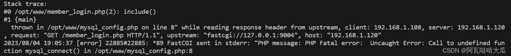

预览格式 Ctrl + Shift + V
# 关于开发过程中遇到的bug以及解决方法

- 本机环境：ubuntu 18.4 cmake 3.25.2 gcc 9.4.0 libprotoc 3.9.1


## <font color="red">protobuf链接错误</font>
### CMAKE+protobuf报错对‘google::protobuf::internal::fixed_address_empty_string’未定义的引用

ubuntu自带proto2，不要安装.
编译过程中
./configure 这是默认的命令，会安装到 /usr/local/bin，我不推荐
`./configure --prefix=/usr/`，我建议直接安装到 /usr/bin下

估计有50多个未定义错误把：
```bash
CMakeFiles/robotsd.dir/client.cpp.o：在函数‘google::protobuf::internal::GetEmptyStringAlreadyInited()’中：
/usr/include/google/protobuf/message_lite.h:153：对‘google::protobuf::internal::fixed_address_empty_string’未定义的引用
.......对‘google::protobuf::internal::fixed_address_empty_string’未定义的引用
/google/protobuf/message_lite.h:153：......对‘google::protobuf::internal::fixed_address_empty_string’未定义的引用
```
在网上找了半天，说是ABI的错误，其实不是。
```bash
-D_GLIBCXX_USE_CXX11_ABI=0
```
这个解决思路是：_GLIBCXX_USE_CXX11_ABI 主要是为了支持新的C++标准中要禁止std::string的Copy-On-Write行为和支持std::list中size()的时间复杂度为O(1)。
> In the GCC 5.1 release libstdc++ introduced a new library ABI that includes new implementations of std::string and std::list. These　changes were necessary to conform to the 2011 C++ standard which forbids Copy-On-Write strings and requires lists to keep track of their size.

**解决方案**
手动指明链接库
链接库
  在CMakeList.txt中，最后一行，加入：
 -  `target_link_libraries(${MyProjectName} PRIVATE /usr/lib/libprotobuf.a /usr/lib/libprotobuf-lite.a 
/usr/lib/libprotobuf-lite.so /usr/lib/libprotoc.a /usr/lib/libprotoc.so /usr/lib/libprotoc.so.20)`
 - ==不要使用==```bash
-D_GLIBCXX_USE_CXX11_ABI=0```
**直接**
`set(CMAKE_CXX_FLAGS "-Wall -std=c++14 -pthread -lprotobuf -DEPOLL")`


## <font color="red">php-mysql报错</font>
本地搭建web服务器的时候，对登录账号进行数据验证的时候，请求login.php的时候报错 HTTP500 ERROR 500
是服务器段错误，所以去看nginx的日志：

发现member_login.php的mysql语句报错，可以看出问题是由于在 PHP 代码中调用了 mysql_connect() 函数，但该函数在 PHP 7.x 版本中已被移除，导致发生了致命错误（Fatal error）。

> 在 PHP 7.x 版本中，mysql_ 系列函数（例如 mysql_connect()、mysql_query() 等）已经被废弃，并且在 PHP 7.0.0 版本中正式移除。取而代之的是 mysqli_ 和 PDO 系列函数，它们提供了更好的性能和安全性，并且支持更多的功能。为了修复这个问题，你需要将代码中的 mysql_ 系列函数替换为 mysqli_ 或 PDO 系列函数。