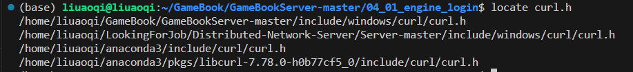

预览格式 Ctrl + Shift + V
# 关于开发过程中遇到的bug以及解决方法

- 本机环境：ubuntu 18.4 cmake 3.25.2 gcc 9.4.0 libprotoc 3.9.1


## <font color="red">protobuf链接错误</font>
### CMAKE+protobuf报错对‘google::protobuf::internal::fixed_address_empty_string’未定义的引用

ubuntu自带proto2，不要安装.
编译过程中
./configure 这是默认的命令，会安装到 /usr/local/bin，我不推荐
`./configure --prefix=/usr/`，我建议直接安装到 /usr/bin下

估计有50多个未定义错误把：
```bash
CMakeFiles/robotsd.dir/client.cpp.o：在函数‘google::protobuf::internal::GetEmptyStringAlreadyInited()’中：
/usr/include/google/protobuf/message_lite.h:153：对‘google::protobuf::internal::fixed_address_empty_string’未定义的引用
.......对‘google::protobuf::internal::fixed_address_empty_string’未定义的引用
/google/protobuf/message_lite.h:153：......对‘google::protobuf::internal::fixed_address_empty_string’未定义的引用
```
在网上找了半天，说是ABI的错误，其实不是。
```bash
-D_GLIBCXX_USE_CXX11_ABI=0
```
这个解决思路是：_GLIBCXX_USE_CXX11_ABI 主要是为了支持新的C++标准中要禁止std::string的Copy-On-Write行为和支持std::list中size()的时间复杂度为O(1)。
> In the GCC 5.1 release libstdc++ introduced a new library ABI that includes new implementations of std::string and std::list. These　changes were necessary to conform to the 2011 C++ standard which forbids Copy-On-Write strings and requires lists to keep track of their size.

**解决方案**
手动指明链接库
链接库
  在CMakeList.txt中，最后一行，加入：
 -  `target_link_libraries(${MyProjectName} PRIVATE /usr/lib/libprotobuf.a /usr/lib/libprotobuf-lite.a 
/usr/lib/libprotobuf-lite.so /usr/lib/libprotoc.a /usr/lib/libprotoc.so /usr/lib/libprotoc.so.20)`
 - ==不要使用==```bash
-D_GLIBCXX_USE_CXX11_ABI=0```
**直接**
`set(CMAKE_CXX_FLAGS "-Wall -std=c++14 -pthread -lprotobuf -DEPOLL")`


## <font color="red">nginx配置php</font>
无法进行反向代理
解决方法：
1. 配置php-fpm.conf
   配置一些fastcgi选项
2. 首先添加虚拟主机，vim /etc/nginx/conf.d/www.conf中加新server
    server{
        server_name 192.168.1.120;
        index index.php;
        root /opt/www;
        include php-fpm72.conf;
    }
3. php-fpm池文件配置，在centos中/etc/php-fpm.d是目录，ubuntu是文件，
   /etc/php-fpm.d=/etc/php/7.2/fpm/www.conf就相当于/etc/php/7.2/fpm/pool.d/www.conf
4. 在centos下
原来的curl是阻塞的，采用curl-multi接口进行http请求。


## <font color="red">php-mysql报错</font>
本地搭建web服务器的时候，对登录账号进行数据验证的时候，请求login.php的时候报错 HTTP500 ERROR 500
是服务器段错误，所以去看nginx的日志：

发现member_login.php的mysql语句报错，可以看出问题是由于在 PHP 代码中调用了 mysql_connect() 函数，但该函数在 PHP 7.x 版本中已被移除，导致发生了致命错误（Fatal error）。

> 在 PHP 7.x 版本中，mysql_ 系列函数（例如 mysql_connect()、mysql_query() 等）已经被废弃，并且在 PHP 7.0.0 版本中正式移除。取而代之的是 mysqli_ 和 PDO 系列函数，它们提供了更好的性能和安全性，并且支持更多的功能。为了修复这个问题，你需要将代码中的 mysql_ 系列函数替换为 mysqli_ 或 PDO 系列函数。

## <font color="red">CMAKE错误</font>
/home/liuaoqi/GameBook/GameBookServer-master/04_01_engine_login/src/apps/login/http_request.h:4:10: fatal error: curl/curl.h: 没有那个文件或目录
    4 | #include <curl/curl.h>
      |          ^~~~~~~~~~~~~
compilation terminated.

添加一下头文件
建立软连接
ln -s 源文件　目标文件　　#源文件：文件实际存放的位置　　目标文件：去寻找的文件
通过软链接建立的目标文件不占用磁盘空间。


target_link_libraries(${MyProjectName} PRIVATE /usr/lib/libprotobuf.a /usr/lib/libprotobuf-lite.a /usr/lib/libprotobuf-lite.so /usr/lib/libprotoc.a /usr/lib/libprotoc.so /usr/lib/libprotoc.so.20 /home/liuaoqi/GameBook/GameBookServer-master/libs/linux/libjsoncpp.so /home/liuaoqi/GameBook/GameBookServer-master/libs/linux/libjsoncpp.a)


## <font color="red">curl的异步处理</font>
原来的curl是阻塞的，采用curl-multi接口进行http请求。
```c++
bool HttpRequest::Init()
	{
	    _pMultiHandle = curl_multi_init();
	    return true;
	}
	
	每一个http请求，都创建一个curl句柄：
	• 初始化curl句柄，加入到curl_master上，并配置请求参数
	
	bool HttpRequest::Init()
	{
	    _pCurl = curl_easy_init();
		curl_multi_add_handle(_pMultiHandle, _pCurl);
		curl_easy_setopt(_pCurl, CURLOPT_POST, true);
	
	    return true;
	}
	
	• 异步执行请求：
	在一个循环中，使用 curl_multi_perform 函数来异步执行请求。
	
	CURLMcode curlMcode = curl_multi_perform(_pMultiHandle, &running_handle_count);
	
	curlMcode会返回curl的状态码，
	• 使用 curl_multi_info_read 函数来检查哪些请求已经完成，并对它们进行处理。
	
	msg = curl_multi_info_read(_pMultiHandle, &msgs_left);
	• 清理和关闭句柄
	
	curl_multi_remove_handle(_pMultiHandle, _pCurl);
	curl_easy_cleanup(_pCurl);
	curl_multi_cleanup(_pMultiHandle);
```


## <font color="red">link报错</font>
定位文件，明确错误过程，link错误就是库链接不对，像这种99+的未定义就是，库链接不到。


## <font color="red"> 子类包含父类对象时，如何初始化父类对象</font>
子类不能初始化父类字段
初始化列表相比无参构造函数少了一次赋值操作（this->a = a）。
当对象复杂时会提高效率
```bash
(base) liuaoqi@liuaoqi:~/design_patterns/bridge/jpg.h中应该这样初始化！
Jpg(Filter* f):Image(f){}
```
这样没有创建一个临时对象，只是调用了构造函数，
A a; 这是创建一个对象
A a = A(); 这是创建一个对象+调用构造函数干某事


##  <font color="red">对于读方法使用const</font>
```c++
在.h文件里

#ifndef _DATASTREAM_H
#define _DATASTREAM_H
#include <vector>
#include <string.h>
#include <iostream>
class DataStream {
private:
    // 不定长buffer,这个buffer是可以复用的，还没增加clear功能，
    // 所以你需要记录上一次序列化的结尾
    std::vector<char> buffer;
    // 枚举所有可转换的数据类型
    enum datatype{
        // type-len-value
        INT,
        STRING  // 1B   4B  变长
    };
public:
    /*
        对于每个序列化对象，需要记录它的TLV,
        写buffer三次
        write作为基础成员函数，形参限定写入buffer的条件，例如，地址和大小
        写Type的时候，对象是enum的datatype[INT]=0, 形参：地址是&datatype[INT]，大小是1B（我规定enum的type都用1B存）
        写Len的时候，对象是size=4, 形参： 地址是&size, 大小是sizeof(int)
        写Value的时候，对象是data，形参：地址是&data，大小是sizeof(int)
    */
    DataStream(){}
    ~DataStream(){}
    void write(char* addr, int len);
    void write(int num);
    void show() const;
};
#endif

在.cpp文件里
void DataStream::show() const{
    int size = buffer.size();
    std::cout  << "data_size:" << size << std::endl;
}
这里的const一定要写，不然找不到函数。。。。。


```


##  <font color="red">如果一定要使用抽象类对象</font>
   1. 1.抽象类不能实例化
   2. 有时候非要用抽象类对象怎么办
   要用指针或引用
   ```c++
   // class
   void write(const Serialize& a);
   bool read(Serialize& a);
   // 形参必须要加引用才行。
   // DataStream& operator << (Serialize a);  
   DataStream& operator << (const Serialize& a);  
   DataStream& operator >> (Serialize& a);
   ```


##  <font color="red">可变参数使用报错</font>
递归方式：
要一个一个取出参数，template比较麻烦

折叠表达式更简单：
   ```c++
    #include <cstdio>
    #include <iostream>
    // exit
    void f(){}
    template<typename T, typename...Args>
    void f(T arg1, Args...arg2) {
        std::cout << arg1 <<" ";
        f(arg2...);
    }
    int main()
    {
    int t1=2;
    double t2=3;
    char t3='a';
    f(t1, t2, t3);
    return 0;
    }

   ```


##  <font color="red">线程池实现</font>
while(true)是在线程池的工作线程中用于循环获取任务的一种常见做法，确保工作线程在整个生命周期中保持活跃状态，随时准备处理新的任务。


i=0时去进行线程1的构造的时候，这个线程已经算是“建好了”，线程1就自己跑自己去了，直接i++去了
程序就去执行i=1了，这个线程已经算是“建好了”，线程2就自己跑自己去了，直接i++去了
i=3之后，这个for就结束了，这个for就一个语句。
就是去跑3个线程了，因为线程的函数是while(true) 所以不会啾地一下结束了。然后就一直等新任务
  
##  <font color="red">任务队列的绑定</font>
std::move(this->_taskQueue.front());
在这行代码中，使用std::move是为了实现资源的转移而不是拷贝。在C++中，std::queue是基于容器的，每个元素都有一个拷贝构造函数。当你尝试从队列中取出一个任务时，将调用任务类型的拷贝构造函数来创建一个新的任务对象。

然而，拷贝任务对象可能涉及到较大的开销，特别是当任务是一个函数对象时，其中可能包含大量的数据。为了避免不必要的拷贝开销，可以使用std::move将任务对象的资源所有权从队列中转移到oneTask中，而不是创建一个新的任务对象。

【什么时候用这个move，对象with point member/对象很大的时候！】
std::move是C++11中引入的移动语义的关键字，它将一个左值转换为右值引用，从而允许资源的所有权转移。对于支持移动语义的类型（例如，拥有移动构造函数和移动赋值运算符的类型），使用std::move可以显著提高性能，避免不必要的拷贝操作。

在这里，std::move(this->_taskQueue.front())将任务队列中的队首任务对象的资源所有权转移到oneTask中，这样oneTask将变成队首任务的副本，而队首的任务对象将被从队列中移除。这样做既避免了任务对象的不必要拷贝，又确保任务队列中的任务被逐个执行。


即 采用移动拷贝构造/移动赋值运算符 取代 拷贝构造函数/赋值运算符，将 左值转换成右值引用，转移了资源所有权。


##  <font color="red">apache和nginx端口冲突</font>

采用的nginx进行反向代理，默认端口是80；选择apache的abs来进程压力测试，
   ```bash
    sudo apt update
    sudo apt install apache2-utils
   ```
   abs存在于apache2工具集中，启动了apache2，默认端口也是80
   修改了apache2的端口为82:
    step1：修改监听端口以及主机端口为90
    打开目录/etc/apache2/ports.conf文件，将端口的80改为82,443改成了442
    命令sudo vi /etc/apache2/ports.conf
    step2: 只要修改virtualHost的端口即可
    在ports.conf文件中看到了注释，/etc/apache2/sites-enabled/000-default文件，打开文件后把<VirtualHost *:80>修改成90
    step3：重启apache2
    命令service apache2 start

##  <font color="red">ab报错apr_pollset_poll 7007</font>
    ```bash
    (base) liuaoqi@liuaoqi:~$ ab -n 1000 -c 100 http://192.169.1.120/
    This is ApacheBench, Version 2.3 <$Revision: 1807734 $>
    Copyright 1996 Adam Twiss, Zeus Technology Ltd, http://www.zeustech.net/
    Licensed to The Apache Software Foundation, http://www.apache.org/

    Benchmarking 192.169.1.120 (be patient)
    apr_pollset_poll: The timeout specified has expired (70007)
    ```
    主要是timeout连接超时了，可以加个-k参数，让连接KeepAlive


##  <font color="red">在ubuntu中的浏览器中访问nginx的端口，出现的却是apache的欢迎页</font>
apache与nginx是共用同一个站点目录的，即在apache和nginx中部署的网页文件都放在同一个目录下---/var/www/html


##  <font color="red">配置log4cplus</font>
在使用到了log4cplus的项目CMakeLists.txt中要加 CMAKE_CXX_FLAGS 的属性 -llog4cplus
如果遇到了动态库的错误，也要配置动态库路径。